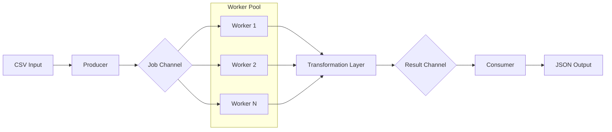

<div align="center">
  <h1>Go File Processor</h1>
  <p>Processamento paralelo e resiliente de arquivos massivos com Worker Pool em Go.</p>

  

  <br>

[](https://github.com/ESousa97/go-file-processor/actions)
[](https://goreportcard.com/report/github.com/ESousa97/go-file-processor)
[](https://www.codefactor.io/repository/github/ESousa97/go-file-processor)
[](https://pkg.go.dev/github.com/ESousa97/go-file-processor)
[](https://opensource.org/licenses/MIT)
[](https://github.com/ESousa97/go-file-processor)
[](https://github.com/ESousa97/go-file-processor/commits/main)

</div>

---

O **Go File Processor** é uma ferramenta de linha de comando e biblioteca de alto desempenho projetada para converter arquivos CSV massivos (milhões de registros) em JSON estruturado de forma eficiente. Utilizando o padrão Worker Pool e processamento via canais (channels), garante o uso otimizado de CPU e memória constante, independentemente do tamanho do arquivo de entrada.

## Demonstração

### Como Biblioteca

Adicione transformadores e configure o pool de execução de forma fluida:

```go
proc := processor.NewCSVToJSONProcessor()
config := processor.Config{WorkerCount: 8}

// Adicione transformadores (Chain of Responsibility)
config.AddTransformer(processor.EmailFilter(`@company.com$`))
config.AddTransformer(processor.FieldMasker("email"))

metrics, err := proc.Process("input.csv", "output.json", config)
```

### Como CLI

Execute processamentos massivos com métricas em tempo real:

```bash
./fileproc -input data.csv -output data.json -workers 4
```

Output:

```text
[INFO] Iniciando processamento...
[INFO] Progresso: 100000 linhas processadas
[RESUMO] EXECUÇÃO CONCLUÍDA EM 1.2s
- Total de linhas lidas: 100000
- Processadas com sucesso: 98500
- Erros/Ignoradas: 1500
```

## Stack Tecnológico

| Tecnologia          | Papel                                                               |
| ------------------- | ------------------------------------------------------------------- |
| **Go 1.22+**        | Linguagem principal com concorrência nativa de alta performance     |
| **Worker Pool**     | Gerenciamento de paralelismo e controle de carga                    |
| **slog**            | Structured logging para observabilidade e rastreabilidade           |
| **Atomic Counters** | Coleta de métricas de alta performance sem contenção (lock-free)    |
| **Channels**        | Comunicação segura e desacoplada entre Producer, Workers e Consumer |

## Pré-requisitos

- **Go >= 1.22**
- **Make** (para automação de build e benchmarks)

## Instalação e Uso

### A partir do source

```bash
git clone https://github.com/ESousa97/go-file-processor.git
cd go-file-processor
make build
```

### Geração de Dados e Benchmark

Para validar a performance com arquivos de 100k+ linhas:

```bash
make generate-data
make bench
```

## Makefile Targets

| Target               | Descrição                                                 |
| -------------------- | --------------------------------------------------------- |
| `make build`         | Compila o binário `fileproc` na raiz do projeto           |
| `make test`          | Executa a suíte de testes unitários                       |
| `make bench`         | Roda comparativos de performance (Sequencial vs Paralelo) |
| `make generate-data` | Gera arquivo de teste massivo (100.000 registros)         |
| `make clean`         | Remove binários e arquivos temporários                    |

## Arquitetura

O projeto utiliza um modelo de streaming baseado em canais para processar dados sem carregar o arquivo inteiro na memória.



## API Reference

Documentação técnica detalhada disponível em [pkg.go.dev/github.com/ESousa97/go-file-processor](https://pkg.go.dev/github.com/ESousa97/go-file-processor).

## Configuração (CLI Flags)

| Flag       | Descrição                         | Tipo     | Padrão        |
| ---------- | --------------------------------- | -------- | ------------- |
| `-input`   | Caminho do arquivo CSV de entrada | `string` | `input.csv`   |
| `-output`  | Caminho do arquivo JSON de saída  | `string` | `output.json` |
| `-workers` | Número de workers simultâneos     | `int`    | `4`           |

## Roadmap

Acompanhe as etapas de evolução do projeto:

- [x] **Fase 1: Fundação** — Implementação do Worker Pool e streaming core.
- [x] **Fase 2: Transformação** — Camada de Middleware (Chain of Responsibility).
- [x] **Fase 3: Observabilidade** — Métricas atômicas e logs estruturados (`slog`).
- [x] **Fase 4: Governança** — CI/CD, Documentação profissional e Badges.

## Contribuindo

Interessado em colaborar? Veja nosso [CONTRIBUTING.md](CONTRIBUTING.md) para padrões de código e processo de PR.

## Licença

Este projeto está licenciado sob a **MIT License** — veja o arquivo [LICENSE](LICENSE) para detalhes.

<div align="center">

## Autor

**Enoque Sousa**

[](https://www.linkedin.com/in/enoque-sousa-bb89aa168/)
[](https://github.com/ESousa97)
[](https://enoquesousa.vercel.app)

**[⬆ Voltar ao topo](#go-file-processor)**

Feito com ❤️ por [Enoque Sousa](https://github.com/ESousa97)

**Status do Projeto:** Ativo — Em constante atualização

</div>
