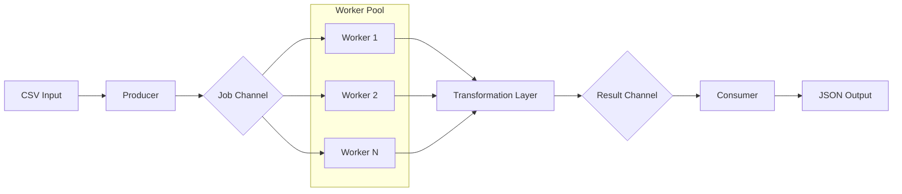

<div align="center">
  <h1>Go File Processor</h1>
  <p>Parallel and resilient processing of massive files with Worker Pool in Go.</p>

  

  <br>

[](https://github.com/ESousa97/go-file-processor/actions)
[](https://goreportcard.com/report/github.com/ESousa97/go-file-processor)
[](https://www.codefactor.io/repository/github/ESousa97/go-file-processor)
[](https://pkg.go.dev/github.com/ESousa97/go-file-processor)
[](https://opensource.org/licenses/MIT)
[](https://github.com/ESousa97/go-file-processor)
[](https://github.com/ESousa97/go-file-processor/commits/main)

</div>

---

**Go File Processor** is a high-performance command-line tool and library designed to efficiently convert massive CSV files (millions of records) into structured JSON. Using the Worker Pool pattern and channel-based processing, it ensures optimized CPU usage and constant memory consumption, regardless of the input file size.

## Demonstration

### As a Library

Add transformers and configure the execution pool fluently:

```go
proc := processor.NewCSVToJSONProcessor()
config := processor.Config{WorkerCount: 8}

// Add transformers (Chain of Responsibility)
config.AddTransformer(processor.EmailFilter(`@company.com$`))
config.AddTransformer(processor.FieldMasker("email"))

metrics, err := proc.Process("input.csv", "output.json", config)
```

### As a CLI

Run massive processing with real-time metrics:

```bash
./fileproc -input data.csv -output data.json -workers 4
```

Output:

```text
[INFO] Starting processing...
[INFO] Progress: 100000 rows processed
[SUMMARY] EXECUTION COMPLETED IN 1.2s
- Total lines read: 100000
- Successfully processed: 98500
- Errors/Ignored: 1500
```

## Tech Stack

| Technology          | Role                                                                |
| ------------------- | ------------------------------------------------------------------- |
| **Go 1.22+**        | Core language with high-performance native concurrency              |
| **Worker Pool**     | Parallelism management and load control                             |
| **slog**            | Structured logging for observability and traceability               |
| **Atomic Counters** | High-performance metrics collection without contention (lock-free)  |
| **Channels**        | Secure and decoupled communication between Producer, Workers, and Consumer |

## Prerequisites

- **Go >= 1.22**
- **Make** (for build automation and benchmarks)

## Installation and Usage

### From Source

```bash
git clone https://github.com/ESousa97/go-file-processor.git
cd go-file-processor
make build
```

### Data Generation and Benchmark

To validate performance with 100k+ row files:

```bash
make generate-data
make bench
```

## Makefile Targets

| Target               | Description                                               |
| -------------------- | --------------------------------------------------------- |
| `make build`         | Compiles the `fileproc` binary at the project root        |
| `make test`          | Runs the unit test suite                                  |
| `make bench`         | Runs performance comparisons (Sequential vs Parallel)     |
| `make generate-data` | Generates a massive test file (100,000 records)           |
| `make clean`         | Removes binaries and temporary files                      |

## Architecture

The project uses a channel-based streaming model to process data without loading the entire file into memory.



## API Reference

Detailed technical documentation available at [pkg.go.dev/github.com/ESousa97/go-file-processor](https://pkg.go.dev/github.com/ESousa97/go-file-processor).

## Configuration (CLI Flags)

| Flag       | Description                       | Type     | Default       |
| ---------- | --------------------------------- | -------- | ------------- |
| `-input`   | Input CSV file path               | `string` | `input.csv`   |
| `-output`  | Output JSON file path             | `string` | `output.json` |
| `-workers` | Number of concurrent workers       | `int`    | `4`           |

## Roadmap

Follow the project's evolution stages:

- [x] **Phase 1: Foundation** — Worker Pool and streaming core implementation.
- [x] **Phase 2: Transformation** — Middleware layer (Chain of Responsibility).
- [x] **Phase 3: Observability** — Atomic metrics and structured logs (`slog`).
- [x] **Phase 4: Governance** — CI/CD, Professional documentation, and Badges.

## Contributing

Interested in collaborating? Check our [CONTRIBUTING.md](CONTRIBUTING.md) for code standards and PR process.

## License

This project is licensed under the **MIT License** — see the [LICENSE](LICENSE) file for details.

<div align="center">

## Author

**Enoque Sousa**

[](https://www.linkedin.com/in/enoque-sousa-bb89aa168/)
[](https://github.com/ESousa97)
[](https://enoquesousa.vercel.app)

**[⬆ Back to top](#go-file-processor)**

Made with ❤️ by [Enoque Sousa](https://github.com/ESousa97)

**Project Status:** Active — Constantly updated

</div>
