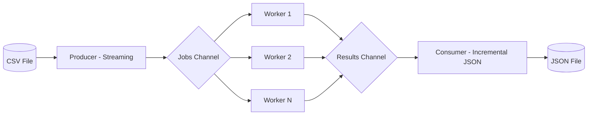

<div align="center">
  <h1>Go File Processor</h1>
  <p>Processador de arquivos massivos com streaming e escalabilidade via Worker Pool.</p>

  

  <br>

  
  [](https://goreportcard.com/report/github.com/ESousa97/go-file-processor)
  [](https://www.codefactor.io/repository/github/ESousa97/go-file-processor)
  
  
  
  
</div>

---

O **Go File Processor** é uma pipeline de processamento de dados projetada para lidar com milhões de registros de forma eficiente. Utilizando streaming de IO e o padrão **Worker Pool**, o sistema garante um consumo de memória constante e previsível, independente do tamanho do arquivo de entrada. É a solução ideal para transformações de dados em larga escala (ETL) e processamento de logs.

## Demonstração

### Processamento CSV para JSON
Converta arquivos CSV gigantescos para JSON estruturado em segundos, utilizando o poder da concorrência:

```bash
go run cmd/main.go
```

Exemplo de entrada (`data/users.csv`):
```csv
id,name,email,role
1,Admin User,admin@example.com,administrator
2,Regular Joe,joe@example.com,editor
```

```

### Camada de Transformação (Middleware)
O sistema agora suporta transformações em cadeia, permitindo filtrar e modificar dados antes da exportação:

```go
config := processor.Config{
    WorkerCount: 5,
    Transformers: []processor.Transformer{
        processor.EmailFilter(`^[a-z0-0._%+\-]+@[a-z0-0.\-]+\.[a-z]{2,4}$`), // Filtro Regex
        processor.RoleFilter([]string{"administrator", "editor"}),          // Filtro de Permissões
        processor.FieldMasker("role"),                                      // Mascaramento Sensível
    },
}
```

```

### Logs e Métricas (slog)
O processador utiliza a biblioteca `slog` para logs estruturados e fornece métricas detalhadas ao final da execução:

- **Total de linhas**: Quantidade de registros lidos.
- **Sucesso**: Registros processados e gravados.
- **Erros**: Linhas inválidas ou falhas de encoding.
- **Resiliência**: O processamento não interrompe ao encontrar linhas corrompidas.

| Tecnologia | Papel |
|------------|-------|
| **Go 1.25** | Runtime de alta performance com concorrência nativa |
| **Worker Pool** | Gerenciamento de goroutines para processamento paralelo |
| **Streaming IO** | Leitura e escrita direta em disco sem carregar tudo em RAM |
| **bufio.Scanner** | Parsing eficiente de arquivos linha a linha |
| **JSON Encoder** | Serialização incremental de dados |

## Pré-requisitos

- **Go >= 1.25**

## Instalação e Uso

### A partir do source

```bash
git clone https://github.com/ESousa97/go-file-processor.git
cd go-file-processor
go build -o processor ./cmd/main.go
./processor
```


## Automação e Benchmarking

O projeto conta com um `Makefile` para facilitar o desenvolvimento e testes de performance.

### Comandos Disponíveis (Make)
```bash
make build          # Compila o projeto
make test           # Executa testes unitários
make bench          # Executa a suíte de benchmarks
make generate-data  # Gera 100k registros de teste
make clean          # Remove arquivos gerados
```

### Comandos Manuais (Alternativa sem Make)
Caso o comando `make` não esteja disponível:
```bash
# Gerar dados
go run scripts/gen_data.go data/large_test.csv 100000

# Rodar Benchmarks
go test -bench=. -benchmem ./internal/processor/...
```

## Arquitetura

O projeto utiliza um pipeline concorrente para maximizar o throughput sem comprometer a estabilidade do sistema.

### Pipeline de Processamento
1. **Producer**: Lê o arquivo CSV linha a linha e despacha para o canal de jobs.
2. **Worker Pool**: Conjunto de goroutines que transformam os dados simultaneamente.
3. **Consumer**: Coleta os resultados e escreve de forma incremental no arquivo de destino.



## Roadmap

- [x] **Fase 1: Estrutura Base** — Interface Processor e conversor CSV/JSON básico.
- [x] **Fase 2: Concorrência** — Implementação de Worker Pool e Canais.
- [x] **Fase 3: Streaming Otimizado** — Uso de bufio e encoders incrementais.
- [x] **Fase 4: Camada de Transformação** — Implementação de Middleware e Chain of Responsibility.
- [x] **Fase 5: Resiliência** — Tratamento de erros avançado e logs estruturados.

## Contribuindo

Pull requests são bem-vindos. Para mudanças maiores, abra uma issue primeiro para discutir o que você gostaria de mudar.

## Licença

Este projeto está licenciado sob a **MIT License** — veja o arquivo [LICENSE](LICENSE) para detalhes.

<div align="center">

## Autor

**Enoque Sousa**

[](https://www.linkedin.com/in/enoque-sousa-bb89aa168/)
[](https://github.com/ESousa97)
[](https://enoquesousa.vercel.app)

**[⬆ Voltar ao topo](#go-file-processor)**

Feito com ❤️ por [Enoque Sousa](https://github.com/ESousa97)

</div>
