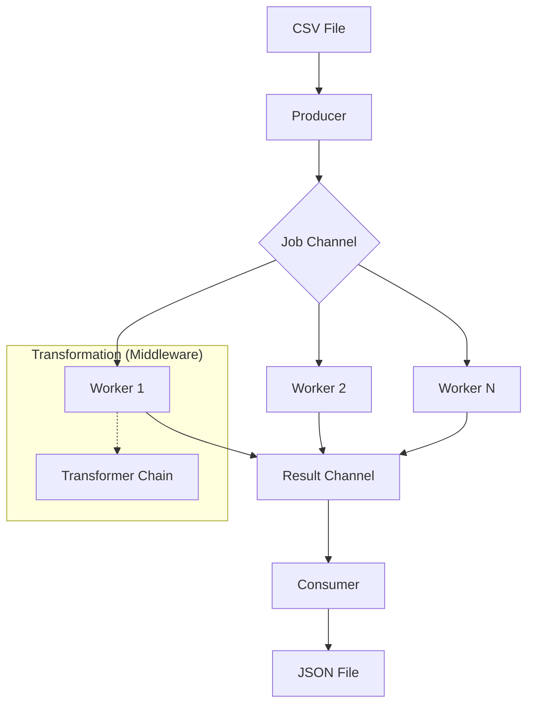

# System Architecture

This document details the architectural decisions and data flow of the **Go File Processor**.

## Data Flow (Pipeline)

The system uses a parallel streaming pipeline to ensure efficiency with massive files.

## Architectural Decisions (ADRs)

### 1. Worker Pool Pattern
**Context**: Processing millions of records via a single main loop would cause I/O blocking and CPU underutilization.
**Decision**: Implement a pool of goroutines (Workers) that process records in parallel.
**Consequence**: Significant throughput increase on multi-core systems.

### 2. Streaming vs Batching
**Context**: Loading the entire file into memory (Full Read) can cause OOM (Out Of Memory) on files dozens of GBs in size.
**Decision**: Process via `io.Reader` and `io.Writer`, keeping only the stream buffer in memory.
**Consequence**: Constant RAM consumption (~20-50MB) regardless of file size.

### 3. Middleware for Transformations
**Context**: Transformation/filter logic should be flexible and decoupled from the core Worker code.
**Decision**: Use the "Chain of Responsibility" pattern via the `Transformer func(*User) bool` type.
**Consequence**: Ease of adding new filters without changing the main worker loop.

### 4. Atomic Metrics
**Context**: Multiple workers need to update success/error counters simultaneously. Mutexes could cause contention.
**Decision**: Use `sync/atomic` for lock-free counting.
**Consequence**: Maximum performance in high-concurrency scenarios.
