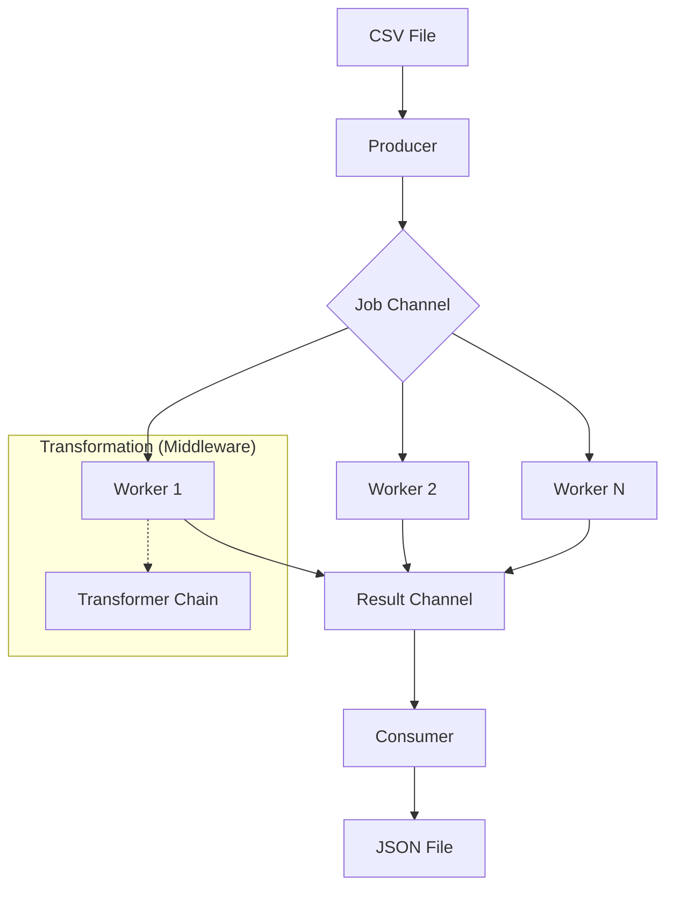

# Historical Architecture Design

This document serves as a reference for the design decisions made during the development of the **Go File Processor**. This project was a study of Go's system architecture capabilities.

## The Streaming Pipeline

The primary goal was to achieve high throughput with **constant memory usage**. We implemented a pipeline where data is processed in individual records, never loading the entire file into RAM.

## Core Architectural Lessons

### 1. The Worker Pool Pattern
**Learning Goal**: Understand how to scale processing by decoupling the producer from the consumers using channels.
**Implementation**: A fixed number of goroutines (Workers) listen on a shared channel.
**Outcome**: High CPU utilization across all cores without manual thread management.

### 2. Backpressure Management
**Learning Goal**: How to prevent the producer from overwhelming the consumer.
**Implementation**: Using buffered channels as a "shock absorber" for data bursts.

### 3. Decoupled Middleware
**Learning Goal**: Implementing clean, pluggable logic using Go's function types.
**Implementation**: Using `Transformer func(*User) bool` as a chain of responsibility.

### 4. Lock-Free Metrics
**Learning Goal**: Avoiding mutex contention in high-concurrency environments.
**Implementation**: Using the `sync/atomic` package for thread-safe global counters.
