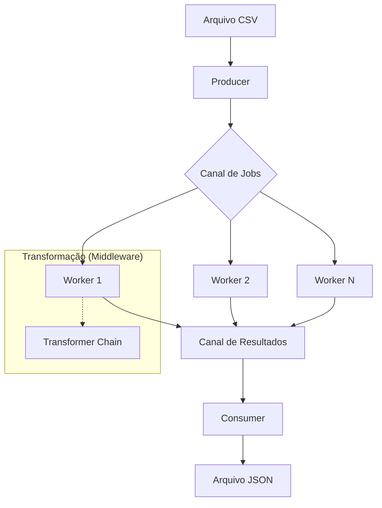

# Arquitetura do Sistema

Este documento detalha as decisões arquiteturais e o fluxo de dados do **Go File Processor**.

## Fluxo de Dados (Pipeline)

O sistema utiliza um pipeline de streaming paralelo para garantir eficiência em arquivos massivos.

## Decisões Arquiteturais (ADRs)

### 1. Worker Pool Pattern
**Contexto**: Processar milhões de registros via um único loop principal causaria bloqueio de I/O e subutilização da CPU.
**Decisão**: Implementar um pool de goroutines (Workers) que processam registros em paralelo.
**Consequência**: Aumento significativo de throughput em sistemas multi-core.

### 2. Streaming vs Batching
**Contexto**: Carregar o arquivo inteiro na memória (Full Read) pode causar OOM (Out Of Memory) em arquivos de dezenas de GBs.
**Decisão**: Processar via `io.Reader` e `io.Writer`, mantendo apenas o buffer de stream em memória.
**Consequência**: Consumo de RAM constante (~20-50MB) independente do tamanho do arquivo.

### 3. Middleware para Transformações
**Contexto**: A lógica de transformação/filtro deve ser flexível e desacoplada do código core do Worker.
**Decisão**: Usar o padrão "Chain of Responsibility" via o tipo `Transformer func(*User) bool`.
**Consequência**: Facilidade para adicionar novos filtros sem alterar o loop principal do worker.

### 4. Métricas Atômicas
**Contexto**: Múltiplos workers precisam atualizar contadores de sucesso/erro simultaneamente. Mutexes poderiam causar contenção.
**Decisão**: Usar `sync/atomic` para contagem sem locks.
**Consequência**: Performance máxima em cenários de alta concorrência.
